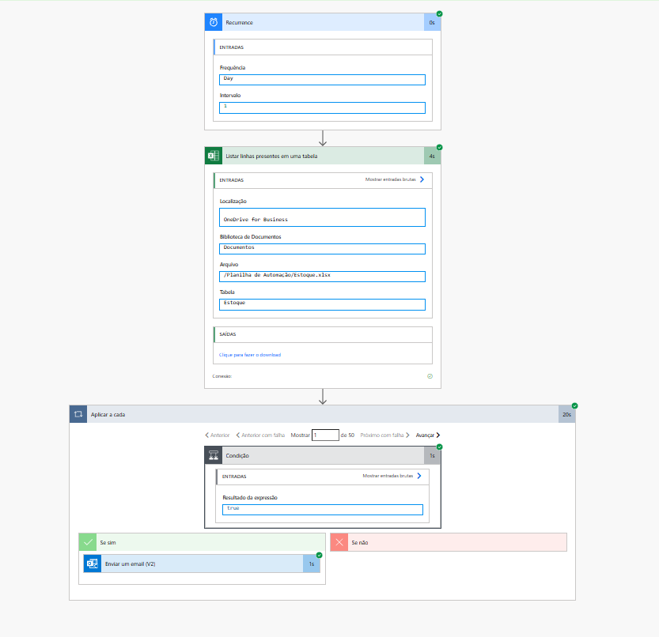

# 📦 Automação de Análise de Estoque

Projeto de automação desenvolvido para monitoramento proativo de níveis de estoque, visando a redução de *Stockouts* (ruptura de estoque) e eliminação de conferências manuais.

## 📷 Visão Geral do Projeto

Aqui você pode ver o "bastidor" (o código) e o "palco" (o resultado final para o usuário).

| Lógica do Robô (Fluxo) | Resultado Final (E-mail) |
|:---:|:---:|
|  |  |
| *O robô analisa a planilha diariamente* | *O alerta chega automaticamente no e-mail* |

---

## 🛠 Tecnologias Utilizadas
* **Power Automate** (Cloud Flow, Lógica Condicional, Gatilhos Agendados)
* **Excel Online / OneDrive for Business** (Base de Dados em Nuvem)
* **Outlook 365** (Sistema de Notificação)

## 📋 Funcionalidades
* **⏰ Monitoramento Contínuo:** O robô "acorda" automaticamente todo dia em horário programado.
* **🧠 Decisão Lógica:** Analisa linha por linha da tabela `Estoque`. Se a `Qtd_Atual` for menor ou igual ao `Estoque_Minimo`, ele ativa o gatilho.
* **📧 Alerta Dinâmico:** Envia um e-mail personalizado contendo o Nome do Produto, Quantidade Restante e aviso de reposição imediata.

---

## 🏗️ Como foi construído (Passo a Passo)

O projeto foi estruturado em três etapas principais para garantir escalabilidade e precisão:

### 1. Modelagem de Dados (Excel)
* Criação de uma base de dados contendo `ID`, `Produto`, `Qtd_Atual` e `Estoque_Minimo`.
* Formatação dos dados como **Tabela Oficial do Excel**, permitindo que o Power Automate identifique e manipule as colunas dinamicamente.
* Hospedagem do arquivo no **OneDrive for Business**, habilitando a leitura em nuvem sem necessidade de máquina local ligada.

### 2. Configuração do Fluxo (Power Automate)
* **Gatilho:** Configurado via *Recurrence* para execução diária automática.
* **Leitura:** Utilização da ação *List rows present in a table* para carregar os dados atualizados da planilha.
* **Iteração:** Implementação de um laço *Apply to each* (Aplicar a cada) para processar os produtos individualmente.

### 3. Lógica Condicional e Alerta
* Aplicação de uma **Condição** matemática dentro do loop: `Qtd_Atual` (dinâmico) <= `Estoque_Minimo`.
* No ramo **"Caso Sim"**, foi configurada a ação *Send an email (V2)* do Outlook, utilizando variáveis dinâmicas para preencher o Assunto e o Corpo do e-mail com os dados específicos do item crítico.

---

## 🚀 Como testar este projeto
1. Baixe o arquivo `Estoque.xlsx` disponível neste repositório.
2. Suba para o seu OneDrive for Business (conta institucional ou corporativa).
3. Importe a lógica no Power Automate e aponte para o arquivo no seu OneDrive.
